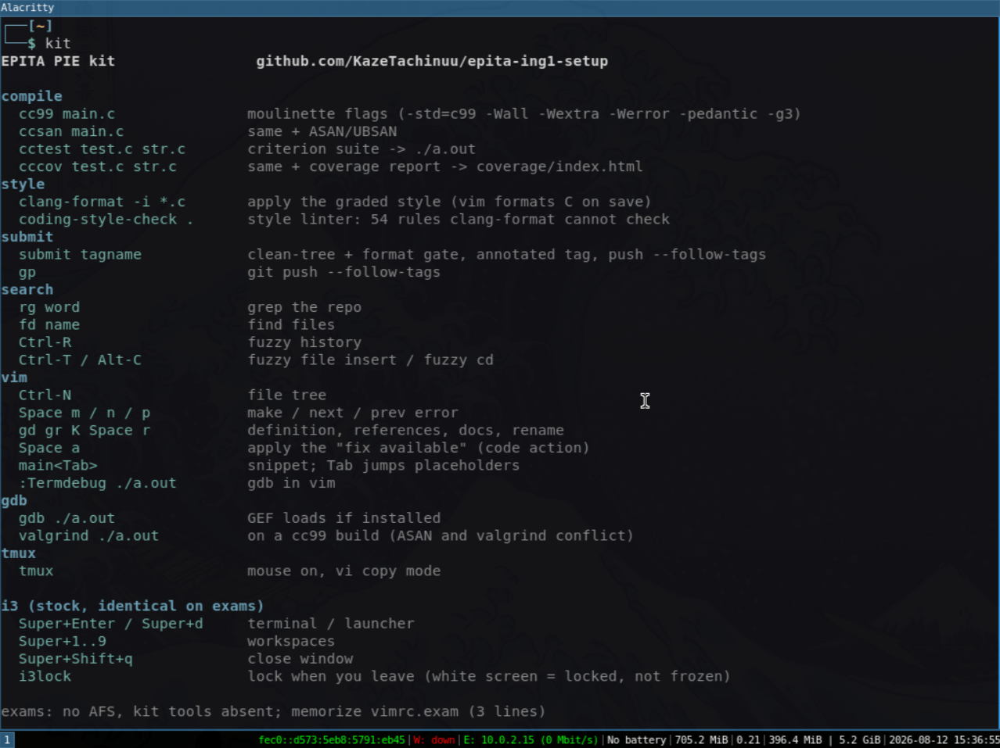

# epita-ing1-setup

Dev environment for the EPITA PIE. The PIE wipes your home every session
but runs `~/afs/.confs/install.sh` at each login; this kit lives there
and re-links itself, so it follows you to every machine on every campus.

```sh
curl -fsSL https://raw.githubusercontent.com/KazeTachinuu/epita-ing1-setup/master/setup.sh | sh
```

Log out, log back in. Re-run any time to update.



- **vim**: clangd LSP (goto-def, references, rename, diagnostics,
  completion), auto-pairs, snippets, format-on-save with the moulinette's
  `.clang-format`
- **bash**: git-aware prompt, `cc99` / `ccsan` aliases with the
  moulinette's flags (-Werror, ASAN+UBSAN), `cctest` for criterion
- **gdb**: history, pretty-print, and GEF (pinned, checksum-verified)
- **bash extras**: ble.sh autosuggestions and syntax highlighting
- **tmux**, **readline**, **alacritty**, **starship** with my prompt
  config (`PIE_MINIMAL=1` skips starship, ble.sh and GEF)

Configs are fetched from a pinned commit and starship is
checksum-verified: what you run is what was reviewed.

## Exams

Exam machines have no AFS and no network; nothing above exists there.
Memorize 3 lines (`vimrc.exam`), line 1 first: writing any `~/.vimrc`
disables the built-in `defaults.vim`, and line 1 turns it back on.

```vim
source $VIMRUNTIME/defaults.vim
set nu et sw=4 sts=4 cc=80
set hls ic scs cb=unnamedplus
```

Practice on the real image: `./harness.sh exam`

## Development

Needs docker, bats, and the nixos-pie image:
`nix build github:epita/nixpie#nixos-pie-docker`, then `docker load`.

| command | what it does |
|---|---|
| `./harness.sh login` | PIE shell, kit applied |
| `./harness.sh exam` | stock exam machine |
| `./harness.sh gui` | full i3 desktop in a window |
| `./harness.sh vm` | boot the real PIE in QEMU/KVM |
| `./harness.sh reset` | wipe the fake AFS |
| `bats test.bats` | the kit applies, and can never break a login |

The harness replays the real login path from nixpie's PAM hook.

VM clipboard: the harness exposes a qemu-vdagent channel; the guest half
needs spice-vdagent running inside the VM (root for the daemon):

```sh
nix profile install nixpkgs#spice-vdagent
sudo spice-vdagentd && spice-vdagent
```
